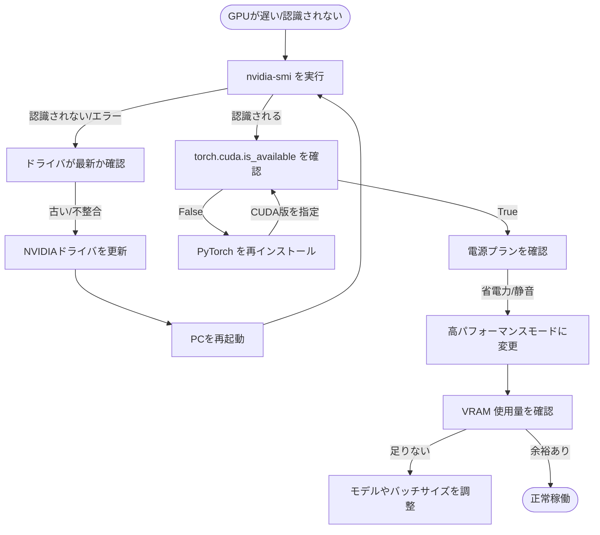

# 🧠 GPU トラブル診断フローチャート

NVIDIA GPU が正しく認識されない、または速度が遅い場合の診断フローです。



## 💡 各ステップの詳細

### 1. nvidia-smi の実行
PowerShell で `nvidia-smi` と入力してください。GPU 名とドライババージョンが表示されれば、ハードウェアレベルでは認識されています。

### 2. PyTorch (torch) の確認
Python 環境で以下を実行します：
```python
import torch
print(torch.cuda.is_available()) # True である必要があります
```
ここが `False` の場合、プログラムは CPU で動いています。

### 3. 電源プランの重要性
ゲーミングノート PC では、バッテリー駆動や「静音モード」の際、dGPU（外付け GPU）が低速動作したり、無効化されたりすることがあります。必ず AC アダプタを接続し、「最適なパフォーマンス」に設定してください。

### 4. ドライバとライブラリの不一致
ドライバを新しくした際、過去にインストールしたライブラリが古い CUDA バージョンを探し続けてエラーになることがあります。その場合は、`pip install` をやり直すのが最も確実です。
